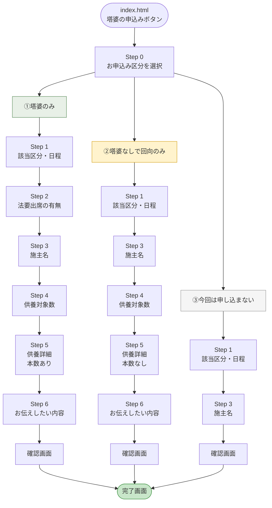

# 勝楽寺 塔婆申込みフォーム 遷移マップ

## 全体フロー

## 各フローの詳細

### ①塔婆のみ（全6ステップ）

| ステップ | 内容 | 入力項目 |
|---|---|---|
| Step 0 | お申込み区分 | ①塔婆のみ を選択 |
| Step 1 | 該当区分・日程 | 5/17 / 6/17 / 7/17 |
| Step 2 | 法要出席 | 出席する／欠席する |
| Step 3 | 施主名 | お名前・よみがな |
| Step 4 | 供養対象数 | 1〜5 |
| Step 5 | 供養詳細 | ご供養される方・塔婆を上げる方・**本数** |
| Step 6 | お伝えしたい内容 | メッセージ（任意） |
| 確認 | 入力内容確認 | — |
| 完了 | 送信完了 | — |

### ②塔婆なしで回向のみ（全5ステップ）

| ステップ | 内容 | 入力項目 |
|---|---|---|
| Step 0 | お申込み区分 | ②塔婆なしで回向のみ を選択 |
| Step 1 | 該当区分・日程 | 5/17 / 6/17 / 7/17 |
| ~~Step 2~~ | ~~法要出席~~ | **スキップ** |
| Step 3 | 施主名 | お名前・よみがな |
| Step 4 | 供養対象数 | 1〜5 |
| Step 5 | 供養詳細 | ご供養される方・回向を希望される方（**本数なし**） |
| Step 6 | お伝えしたい内容 | メッセージ（任意） |
| 確認 | 入力内容確認 | — |
| 完了 | 送信完了 | — |

### ③今回は申し込まない（全2ステップ）

| ステップ | 内容 | 入力項目 |
|---|---|---|
| Step 0 | お申込み区分 | ③今回は申し込まない を選択 |
| Step 1 | 該当区分・日程 | 5/17 / 6/17 / 7/17 |
| ~~Step 2~~ | ~~法要出席~~ | **スキップ** |
| Step 3 | 施主名 | お名前・よみがな |
| ~~Step 4〜6~~ | ~~供養対象数・詳細・メッセージ~~ | **スキップ** |
| 確認 | 入力内容確認 | — |
| 完了 | 送信完了 | — |

## 進行バー（プログレスバー）表示

| フロー | 表示 |
|---|---|
| ①塔婆のみ | 1/6 → 2/6 → 3/6 → 4/6 → 5/6 → 6/6 |
| ②回向のみ | 1/5 → 2/5 → 3/5 → 4/5 → 5/5 |
| ③申し込まない | 1/2 → 2/2 |
| Step 0（区分選択） | バー非表示 |
