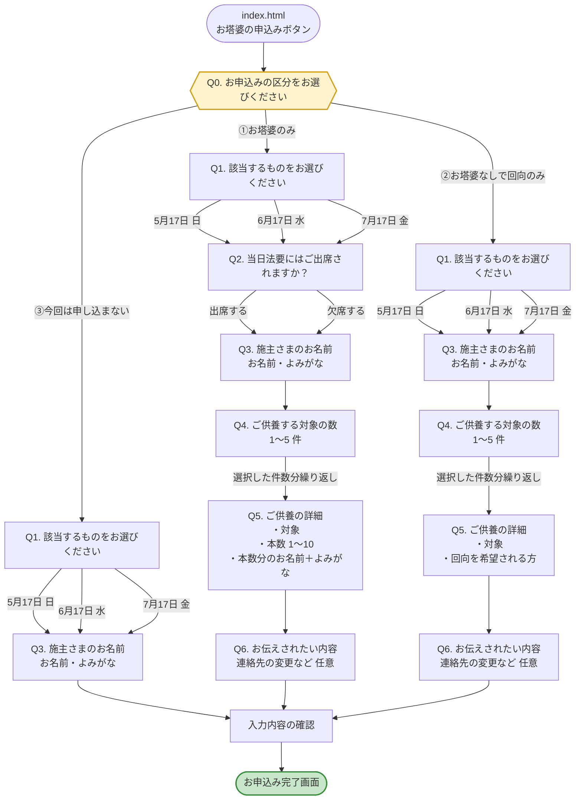
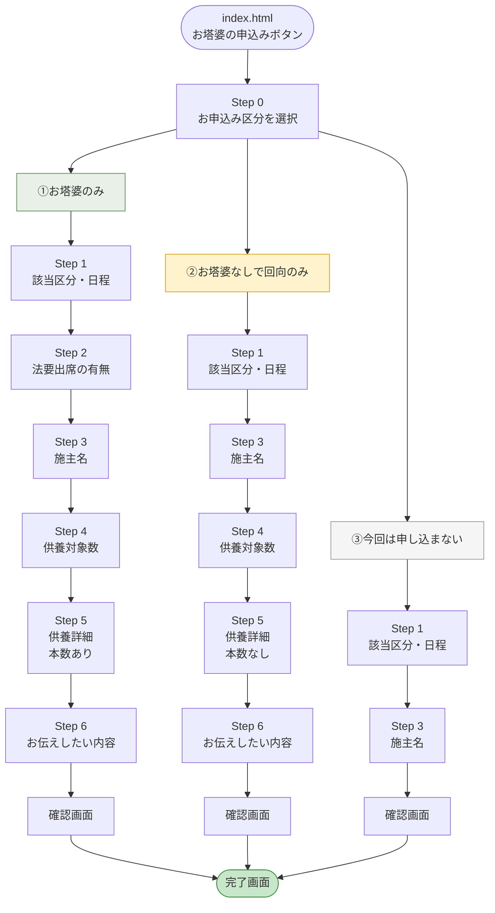

# 勝楽寺 お塔婆申込みフォーム 遷移マップ

## 設問フローチャート（質問と選択肢）

## 設問ごとの選択肢・入力内容

### Q0. お申込みの区分をお選びください

| 選択肢 | 次の設問 |
|---|---|
| ①お塔婆のみ | Q1（以降は全設問） |
| ②お塔婆なしで回向のみ | Q1（Q2を飛ばす／Q5の本数なし） |
| ③今回は申し込まない | Q1（Q2・Q4・Q5・Q6を飛ばす） |

### Q1. 該当するものをお選びください

| 選択肢 | 対象者 |
|---|---|
| 5月17日（日） | おもに納骨堂以外の方 |
| 6月17日（水） | おもに納骨堂・舎利堂の方 |
| 7月17日（金） | 新盆の方 |

※ 申込締切日を過ぎた選択肢は自動的に無効化されます。

### Q2. 当日法要にはご出席されますか？ （①のみ表示）

| 選択肢 |
|---|
| 出席する |
| 欠席する |

### Q3. 施主さまのお名前

| 項目 | 必須 |
|---|---|
| お名前 | 必須 |
| よみがな | 必須 |

### Q4. ご供養する対象の数 （①②のみ表示）

| 選択肢 | 備考 |
|---|---|
| 1 | 例①：〇〇家 先祖代々のみの場合 |
| 2 | |
| 3 | 例②：〇〇家 先祖代々・故人名（父）・故人名（母）の場合 |
| 4 | |
| 5 | |

※ 新盆の故人は 7月17日の新盆施餓鬼でお申込みください。

### Q5. ご供養の詳細 （①②のみ表示、Q4で選択した件数分）

**①お塔婆のみの場合：**

| 項目 | 必須 |
|---|---|
| ご供養される対象 | 必須 |
| 本数（1〜10本） | 必須 |
| 本数分のお名前＋よみがな（セット） | 必須 |

**②回向のみの場合：**

| 項目 | 必須 |
|---|---|
| ご供養される対象 | 必須 |
| 回向を希望される方のお名前 | 必須 |

### Q6. お伝えされたい内容 （①②のみ表示）

| 項目 | 必須 |
|---|---|
| 連絡先の変更などメッセージ | 任意 |

---

## 全体フロー（Step単位）

## 各フローの詳細

### ①お塔婆のみ（全6ステップ）

| ステップ | 内容 | 入力項目 |
|---|---|---|
| Step 0 | お申込み区分 | ①お塔婆のみ を選択 |
| Step 1 | 該当区分・日程 | 5月17日 / 6月17日 / 7月17日 |
| Step 2 | 法要出席 | 出席する／欠席する |
| Step 3 | 施主名 | お名前・よみがな |
| Step 4 | 供養対象数 | 1〜5 |
| Step 5 | 供養詳細 | ご供養される対象・本数・お塔婆を申し込まれる方（本数分の名前・ふりがな） |
| Step 6 | お伝えしたい内容 | メッセージ（任意） |
| 確認 | 入力内容確認 | — |
| 完了 | 送信完了 | — |

### ②お塔婆なしで回向のみ（全5ステップ）

| ステップ | 内容 | 入力項目 |
|---|---|---|
| Step 0 | お申込み区分 | ②お塔婆なしで回向のみ を選択 |
| Step 1 | 該当区分・日程 | 5月17日 / 6月17日 / 7月17日 |
| ~~Step 2~~ | ~~法要出席~~ | **スキップ** |
| Step 3 | 施主名 | お名前・よみがな |
| Step 4 | 供養対象数 | 1〜5 |
| Step 5 | 供養詳細 | ご供養される対象・回向を希望される方（**本数なし**） |
| Step 6 | お伝えしたい内容 | メッセージ（任意） |
| 確認 | 入力内容確認 | — |
| 完了 | 送信完了 | — |

### ③今回は申し込まない（全2ステップ）

| ステップ | 内容 | 入力項目 |
|---|---|---|
| Step 0 | お申込み区分 | ③今回は申し込まない を選択 |
| Step 1 | 該当区分・日程 | 5月17日 / 6月17日 / 7月17日 |
| ~~Step 2~~ | ~~法要出席~~ | **スキップ** |
| Step 3 | 施主名 | お名前・よみがな |
| ~~Step 4〜6~~ | ~~供養対象数・詳細・メッセージ~~ | **スキップ** |
| 確認 | 入力内容確認 | — |
| 完了 | 送信完了 | — |

## 進行バー（プログレスバー）表示

| フロー | 表示 |
|---|---|
| ①お塔婆のみ | 1/6 → 2/6 → 3/6 → 4/6 → 5/6 → 6/6 |
| ②回向のみ | 1/5 → 2/5 → 3/5 → 4/5 → 5/5 |
| ③申し込まない | 1/2 → 2/2 |
| Step 0（区分選択） | バー非表示 |
