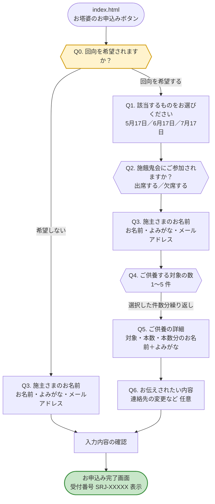
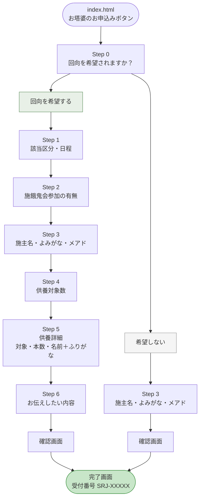

# 勝楽寺 お塔婆申込みフォーム 遷移マップ

## 設問フローチャート

## 設問ごとの選択肢・入力内容

### Q0. 回向を希望されますか？

| 選択肢 | 対応 |
|---|---|
| 回向を希望する | Q1以降の全設問に進む |
| 希望しない | Q3（施主さまのお名前）のみ入力して確認画面へ |

※ ハガキ記載の3区分との対応：  
①お塔婆のみ／②お塔婆なしで回向のみ → 「回向を希望する」  
③今回は申し込まない → 「希望しない」

### Q1. 該当するものをお選びください （希望するのみ表示）

| 選択肢 | 対象者 |
|---|---|
| 5月17日（日） | おもに納骨堂以外の方 |
| 6月17日(水) | おもに納骨堂・舎利堂の方 |
| 7月17日（金） | 新盆の方 |

※ 申込締切日を過ぎた選択肢は自動的に無効化されます。

### Q2. 施餓鬼会にご参加されますか？ （希望するのみ表示）

| 選択肢 |
|---|
| 出席する |
| 欠席する |

### Q3. 施主さまのお名前 （希望する／希望しない 両方で表示）

| 項目 | 必須 |
|---|---|
| お名前 | 必須 |
| よみがな | 必須 |
| メールアドレス | 必須 |

### Q4. ご供養する対象の数 （希望するのみ表示）

| 選択肢 | 備考 |
|---|---|
| 1 | 例①：〇〇家 先祖代々のみの場合 |
| 2 | |
| 3 | 例②：〇〇家 先祖代々・故人名（父）・故人名（母）の場合 |
| 4 | |
| 5 | |

※ 新盆の故人は 7月17日の新盆施餓鬼でお申込みください。

### Q5. ご供養の詳細 （Q4で選択した件数分）

| 項目 | 必須 |
|---|---|
| ご供養される対象 | 必須 |
| 本数（1〜10本） | 必須 |
| 本数分のお名前＋よみがな（セット） | 必須 |

### Q6. お伝えされたい内容 （希望するのみ表示）

| 項目 | 必須 |
|---|---|
| 連絡先の変更などメッセージ | 任意 |

---

## 全体フロー（Step単位）

## 各フローの詳細

### 回向を希望する（全6ステップ）

| ステップ | 内容 | 入力項目 |
|---|---|---|
| Step 0 | 回向のご希望 | 回向を希望する を選択 |
| Step 1 | 該当区分・日程 | 5月17日 / 6月17日 / 7月17日 |
| Step 2 | 施餓鬼会参加 | 出席する／欠席する |
| Step 3 | 施主情報 | お名前・よみがな・メールアドレス |
| Step 4 | 供養対象数 | 1〜5 |
| Step 5 | 供養詳細 | ご供養される対象・本数・お塔婆を申し込まれる方（本数分の名前・ふりがな） |
| Step 6 | お伝えしたい内容 | メッセージ（任意） |
| 確認 | 入力内容確認 | — |
| 完了 | 受付番号（SRJ-XXXXX）表示・スクショ保管必須 | — |

### 希望しない（全1ステップ）

| ステップ | 内容 | 入力項目 |
|---|---|---|
| Step 0 | 回向のご希望 | 希望しない を選択 |
| Step 3 | 施主情報 | お名前・よみがな・メールアドレス |
| 確認 | 入力内容確認 | — |
| 完了 | 受付番号（SRJ-XXXXX）表示・スクショ保管必須 | — |

## 進行バー（プログレスバー）表示

| フロー | 表示 |
|---|---|
| 回向を希望する | 1/6 → 2/6 → 3/6 → 4/6 → 5/6 → 6/6 |
| 希望しない | 1/1（Step 3 のみ） |
| Step 0（回向のご希望） | バー非表示 |
